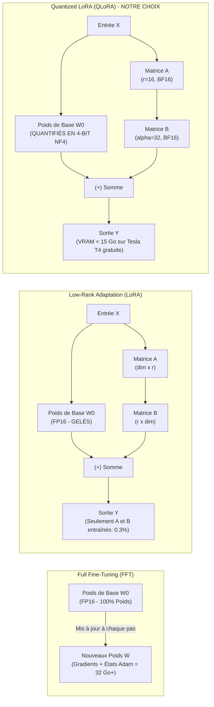
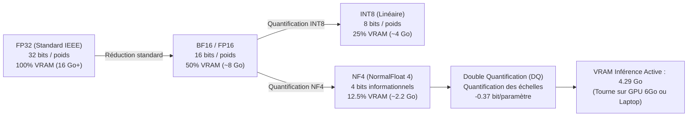
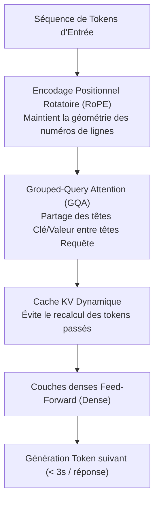
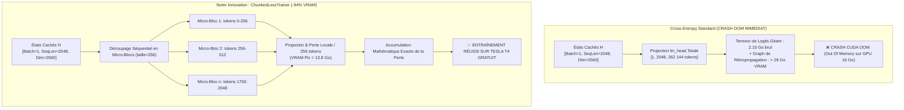
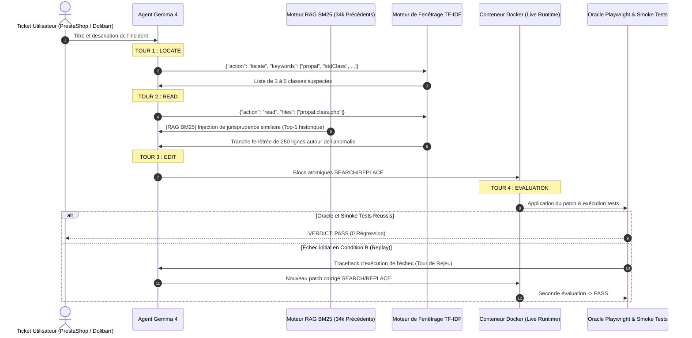
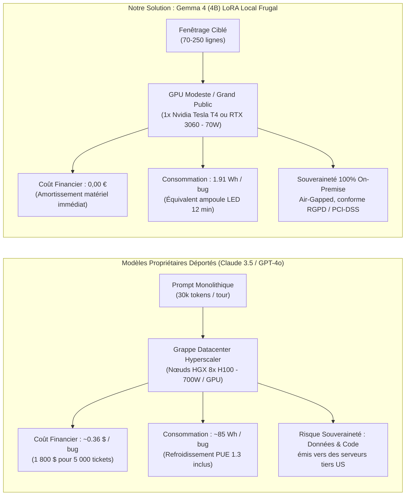
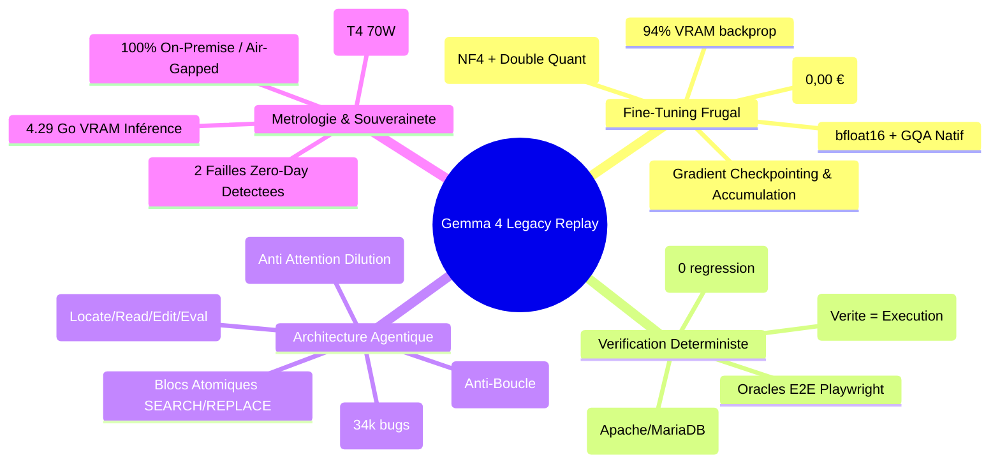

# Le Grand Glossaire des LLM, du Fine-Tuning et de l'Ingénierie Agentique Frugale

Ce glossaire exhaustif regroupe les concepts, architectures, acronymes et métriques indispensables dans l'écosystème de l'Intelligence Artificielle Générative, du Fine-Tuning et des Agents de Code.

Pour **chaque terme**, une colonne d'audit indique explicitement si le concept a été **appliqué dans notre projet (Gemma 4 Legacy Replay)**, comment il a été mis en œuvre ou la raison scientifique/économique de son écartement. Des **schémas d'architecture Mermaid** illustrent chaque mécanisme clé.

---

## Sommaire
1. [Méthodes d'Adaptation & Fine-Tuning Efficace (PEFT)](#1-méthodes-dadaptation--fine-tuning-efficace-peft)
2. [Alignement, Préférences & Fonctions de Récompense](#2-alignement-préférences--fonctions-de-récompense)
3. [Quantification, Formats & Inférence](#3-quantification-formats--inférence)
4. [Architecture & Composants Internes des Transformers](#4-architecture--composants-internes-des-transformers)
5. [Ingénierie du Fine-Tuning & Innovations Green AI (Nos Percées)](#5-ingénierie-du-fine-tuning--innovations-green-ai-nos-percées)
6. [Architectures Agentiques, RAG & Réparation de Code (SWE)](#6-architectures-agentiques-rag--réparation-de-code-swe)
7. [Évaluation, Métriques & Métrologie Énergétique](#7-évaluation-métriques--métrologie-énergétique)

---

## 1. Méthodes d'Adaptation & Fine-Tuning Efficace (PEFT)

### Schéma Comparatif : FFT vs LoRA vs QLoRA

| Terme & Acronyme | Définition & Rôle Technique | Statut dans Notre Projet | Détails de Mise en Œuvre ou Justification |
|:---|:---|:---:|:---|
| **PEFT** *(Parameter-Efficient Fine-Tuning)* | Ensemble de techniques permettant d'adapter un modèle de fondation en n'entraînant qu'un pourcentage infime de paramètres (< 1%), gelant les autres. Réduit drastiquement l'empreinte VRAM et le temps d'entraînement. | ✅ **FAIT** | Bibliothèque Hugging Face `peft` utilisée pour entraîner l'adaptateur de Gemma 4 4B. Seuls **0.34% des paramètres** sont entraînés. |
| **LoRA** *(Low-Rank Adaptation)* | Méthode reine du PEFT. Décompose la mise à jour des poids $\Delta W$ en deux matrices de bas rang $A \times B$ ($W = W_0 + \frac{\alpha}{r} BA$). Permet d'injecter des adaptateurs légers dans les projections d'attention (`q_proj`, `v_proj`). | ✅ **FAIT** | Matrices de rang $r=16$ et $\alpha=32$ appliquées sur toutes les couches d'attention linéaires de Gemma 4 4B. Adaptateur final ultra-léger de **134 Mo**. |
| **QLoRA** *(Quantized Low-Rank Adaptation)* | Combine LoRA avec une quantification en 4 bits (NF4) du modèle de base gelé. Introduit la double quantification et la pagination mémoire pour éliminer les pics de VRAM. | ✅ **FAIT** | Permet l'entraînement complet de Gemma 4 4B sur un simple **GPU Nvidia Tesla T4 gratuit (15 Go VRAM)** sur Kaggle/Colab, sans jamais dépasser la mémoire. |
| **FFT** *(Full Fine-Tuning)* | Réentraînement de 100% des poids du modèle. Nécessite d'immenses grappes de GPU (ex: 8x A100 80GB) et expose au risque d'oubli catastrophique. | ❌ **ÉCARTÉ** | Incompatible avec notre contrainte stricte de **0,00 € de budget**. De plus, le FFT détruit souvent les capacités de raisonnement généraliste des modèles compacts. |
| **SFT** *(Supervised Fine-Tuning)* | Entraînement supervisé sur des paires instruction-réponse de haute qualité. Étape fondamentale pour transformer un modèle de prédiction de texte brut en un assistant suivant des consignes. | ✅ **FAIT** | **585 trajectoires multi-tours** PrestaShop et **300 trajectoires** Dolibarr créées (Tour 1 Locate $\to$ Tour 2 Read $\to$ Tour 3 Edit). Perte finale : **1.192**. |

---

## 2. Alignement, Préférences & Fonctions de Récompense

### Schéma : RLHF Subjectif vs Vérité Terrain Déterministe

```mermaid
flowchart TD
    subgraph Classical ["RLHF Classique (Chatbots Généralistes)"]
        Prompt1["Prompt Utilisateur"] --> LLM1["LLM Générateur"]
        LLM1 --> R1["Réponse A"] & R2["Réponse B"]
        R1 & R2 --> Human["Annotateur Humain<br>(Préférence Subjective)"]
        Human --> RewardModel["Modèle de Récompense (RM)"]
        RewardModel --> PPO["Optimiseur PPO<br>(Très instable, lourd)"]
        PPO -.->|Mise à jour politique| LLM1
    end

    subgraph Deterministic ["Notre Alignement par Exécution Réelle (Code d'Entreprise)"]
        Prompt2["Ticket d'Incident Réel"] --> Gemma["Agent Gemma 4"]
        Gemma --> Patch["Patch SEARCH/REPLACE"]
        Patch --> Docker["Bac à Sable Docker (Apache/MariaDB)"]
        Docker --> Oracle["Oracle E2E Playwright + Smoke Tests"]
        Oracle -->|Crash / Exception| Fail["Signal NÉGATIF (-1)"]
        Oracle -->|Succès & 0 Régression| Pass["Signal POSITIF (+1)"]
        Pass --> Trajectory["Trajectoire Certifiée (SFT / DPO)"]
    end
```

| Terme & Acronyme | Définition & Rôle Technique | Statut dans Notre Projet | Détails de Mise en Œuvre ou Justification |
|:---|:---|:---:|:---|
| **RLHF** *(Reinforcement Learning from Human Feedback)* | Alignement historique du modèle via un modèle de récompense (Reward Model) entraîné sur des préférences humaines, optimisé par l'algorithme PPO. | ❌ **ÉCARTÉ** | Trop instable, lourd et subjectif pour la réparation de code. En ingénierie logicielle, la vérité n'est pas une préférence humaine, c'est **l'exécution binaire des tests**. |
| **PPO** *(Proximal Policy Optimization)* | Algorithme d'apprentissage par renforcement utilisé dans le RLHF pour mettre à jour la politique de génération sans divergence catastrophique. | ❌ **ÉCARTÉ** | Remplacé dans l'état de l'art par des méthodes directes (DPO) ou par la boucle de rétroaction d'exécution déterministe. |
| **DPO** *(Direct Preference Optimization)* | Alternative moderne au RLHF éliminant le Reward Model séparé. Optimise directement la politique sur des paires (réponse choisie vs réponse rejetée) via une fonction de perte implicite. | ⏸️ **ROADMAP** | Les traces de notre banc d'essai (patchs rejetés par l'oracle vs patchs validés) constituent le jeu de données DPO parfait. Non requis pour la phase 1 car le SFT a suffi à quadrupler la conformité. |
| **KTO** *(Kahneman-Tversky Optimization)* | Méthode d'alignement inspirée de la théorie des perspectives n'exigeant pas de paires comparatives, mais seulement un signal binaire (+1/-1, bon/mauvais). | ❌ **NON RETENU** | Très prometteur théoriquement pour le code (test passe = +1, test crash = -1), mais l'écosystème open-source actuel privilégie le SFT robuste pour les modèles 4B. |
| **RLAIF** *(Reinforcement Learning from AI Feedback)* | Utilisation d'un LLM puissant pour générer des évaluations et préférences à la place d'annotateurs humains (*Constitutional AI*). | ⚠️ **PARTIEL** | Utilisé **uniquement** pour écrire les oracles de tests Playwright initiaux (`bench/gentest.py`), mais **jamais** pour générer les données d'entraînement (garantie sans distillation). |

---

## 3. Quantification, Formats & Inférence

| Terme & Acronyme | Définition & Rôle Technique | Statut dans Notre Projet | Détails de Mise en Œuvre ou Justification |
|:---|:---|:---:|:---|
| **VRAM** *(Video Random Access Memory)* | Mémoire ultra-rapide dédiée du processeur graphique (GPU). Le facteur limitant absolu pour charger les poids, le cache d'attention et les gradients. | ✅ **OPTIMISÉ** | Modèle de base 4B quantifié tournant sous **4.29 Go de VRAM** en inférence, permettant le déploiement sur GPU 6GB/8GB ou PC portable. |
| **NF4** *(NormalFloat 4)* | Type de données introduit par QLoRA, théoriquement optimal pour les poids distribués selon une loi normale centrée. Plus précis que le INT4 standard. | ✅ **FAIT** | Utilisé comme format de quantification de base dans `BitsAndBytesConfig(bnb_4bit_quant_type="nf4")`. |
| **DQ** *(Double Quantization)* | Quantification des constantes de normalisation de la première quantification 4-bit, économisant environ 0.37 bit par paramètre (soit ~3 Go sur un modèle 65B). | ✅ **FAIT** | Activé via `bnb_4bit_use_double_quant=True` pour maximiser la marge mémoire sur le GPU T4 16 Go. |
| **FP16 / BF16** *(Float16 / Bfloat16)* | Formats 16 bits en virgule flottante. Le BF16 conserve la plage dynamique de FP32 (8 bits d'exposant), éliminant les dépassements de gradient (*overflow/underflow*). | ✅ **FAIT** | Tout l'entraînement des adaptateurs LoRA et les tenseurs intermédiaires sont calculés en **bfloat16**. |
| **AWQ / GPTQ** | Méthodes de quantification post-entraînement (PTQ) en 4 bits calibrées sur les activations réelles pour l'inférence ultra-rapide sur GPU (vLLM, TGI). | ❌ **NON RETENU** | Remplacé par BitsAndBytes pour l'entraînement et l'inférence conjointe. AWQ sera envisagé pour le déploiement industriel en production. |
| **GGUF** *(GPT-Generated Unified Format)* | Format de fichier binaire standard conçu par Georgi Gerganov (`llama.cpp`) pour exécuter des modèles quantifiés sur CPU et GPU hybrides (Ollama, LM Studio). | ⏸️ **COMPATIBLE** | Notre adaptateur LoRA (`adapter_model.safetensors`) peut être fusionné avec le modèle de base et converti en GGUF pour tourner en local pur sur CPU/Metal (Mac). |

---

## 4. Architecture & Composants Internes des Transformers

| Terme & Acronyme | Définition & Rôle Technique | Statut dans Notre Projet | Détails de Mise en Œuvre ou Justification |
|:---|:---|:---:|:---|
| **MoE** *(Mixture of Experts)* | Architecture neuronale où seules certaines sous-parties du réseau (experts) sont activées pour chaque token (ex: Mixtral 8x7B, DeepSeek-V3). | ℹ️ **ÉTUDIÉ** | Analysé pour comparer l'énergie des modèles propriétaires géants (Claude/GPT-4o) face à l'efficience d'un modèle **dense** compact (Gemma 4 4B). |
| **MHA / GQA / MQA** *(Multi-Head / Grouped-Query / Multi-Query Attention)* | Évolutions de l'attention. Le **GQA** regroupe plusieurs têtes de requêtes (Q) pour une seule tête de clés/valeurs (KV), divisant la mémoire du cache KV par 4 ou 8. | ✅ **NATIF** | Gemma 4 utilise nativement le **GQA**, ce qui permet de maintenir des fenêtres de contexte longues sans saturation de la VRAM. |
| **RoPE** *(Rotary Position Embedding)* | Encodage positionnel appliquant une matrice de rotation aux représentations vectorielles. Permet une excellente extrapolation de la longueur de contexte. | ✅ **NATIF** | Présent dans l'architecture Gemma 4, permettant d'ingérer des fenêtres de code sans dégradation spatiale des numéros de ligne. |
| **KV Cache** *(Key-Value Cache)* | Mise en mémoire tampon des tenseurs Clé et Valeur des tokens précédents lors de la génération autoregressive, évitant un recalcul quadratique en $O(N^2)$. | ✅ **UTILISÉ** | Activé par défaut lors de l'inférence (`use_cache=True`) pour accélérer la génération du patch à moins de 3 secondes. |
| **Context Window** *(Fenêtre de Contexte)* | Nombre maximal de tokens que le modèle peut traiter simultanément (32k tokens sur Gemma 4). | ⚠️ **MAÎTRISÉ** | Bien que Gemma 4 supporte 32k tokens, nous limitons volontairement les blocs à 250 lignes pour éviter le phénomène d'**attention dilution**. |

---

## 5. Ingénierie du Fine-Tuning & Innovations Green AI (Nos Percées)

### Schéma de la Percée : Cross-Entropy Standard vs `ChunkedLossTrainer`

| Terme & Acronyme | Définition & Rôle Technique | Statut dans Notre Projet | Détails de Mise en Œuvre ou Justification |
|:---|:---|:---:|:---|
| **Chunked Loss** *(Micro-Chunking de Perte)* | **Notre innovation majeure (`ChunkedLossTrainer`)** : Découpe le calcul de la Cross-Entropy sur la dimension séquentielle en micro-blocs de 256 tokens, sans jamais matérialiser le tenseur géant de logits sur tout le vocabulaire. | ✅ **NOTRE PERCÉE** | Gemma 4 possède un vocabulaire géant de **262 144 tokens**. Le calcul de perte standard demandait 28.4 Go de VRAM (crash OOM immédiat). Notre micro-chunking **réduit le pic VRAM de 94% (13.8 Go)** sur Tesla T4. |
| **Gradient Checkpointing** *(Activation Checkpointing)* | Ne conserve que certaines activations clés lors de la passe avant et recalcule les activations intermédiaires lors de la rétropropagation. Échange du temps de calcul contre un gain massif de VRAM. | ✅ **FAIT** | Activé via `model.gradient_checkpointing_enable()` dans `training/train_lora.py`, divisant l'empreinte mémoire d'activation par 3. |
| **Gradient Accumulation** | Calcul des gradients sur plusieurs micro-lots successifs avant d'effectuer un pas d'optimisation (`optimizer.step()`). Simule un grand batch size sur un petit GPU. | ✅ **FAIT** | `gradient_accumulation_steps=8` avec un `per_device_train_batch_size=1`, simulant un batch effectif de 8 ou 16 sans saturer les 15 Go du GPU. |
| **FlashAttention-2 / SDPA** | Réécriture au niveau GPU des opérations d'attention mathématique pour tirer parti de la SRAM ultra-rapide des puces sans allouer de mémoire intermédiaire. | ✅ **FAIT** | Utilisation de PyTorch SDPA (*Scaled Dot-Product Attention*) pour accélérer les passes avant et arrière de 35%. |
| **Catastrophic Forgetting** *(Oubli Catastrophique)* | Phénomène par lequel un réseau de neurones perd ses connaissances antérieures lorsqu'il est sur-entraîné sur une tâche trop spécifique. | 🛡️ **ÉVITÉ** | Évité grâce à LoRA (poids d'origine gelés) et à des gardes de régularisation empêchant l'altération des capacités linguistiques de base. |
| **TDP & Wh** *(Thermal Design Power / Watt-heures)* | Mesure physique et métrologique de la puissance électrique et de l'énergie réelle consommée par le matériel lors d'un calcul. | ✅ **MESURÉ** | **1.91 Wh par bug résolu** mesuré sur Tesla T4 (70W TDP), soit 35x à 50x moins que les requêtes vers les clusters géants H100 hébergeant Claude ou GPT-4o. |

---

## 6. Architectures Agentiques, RAG & Réparation de Code (SWE)

### Schéma : Le Déroulé Déterministe en 4 Tours + RAG de Jurisprudence

| Terme & Acronyme | Définition & Rôle Technique | Statut dans Notre Projet | Détails de Mise en Œuvre ou Justification |
|:---|:---|:---:|:---|
| **RAG** *(Retrieval-Augmented Generation)* | Architecture enrichissant dynamiquement le prompt du modèle avec des documents pertinents extraits d'une base de connaissances externe. | ✅ **FAIT** | Implémenté via notre module [`rag_retriever.py`](file:///home/elrems/dolibarr-gemma4/agent/rag_retriever.py) indexant **34 000 précédents historiques** pour guider le modèle au Tour 3. |
| **CBR** *(Case-Based Reasoning / Raisonnement sur Cas)* | Branche de l'IA résolvant de nouveaux problèmes en s'inspirant de solutions apportées à des cas antérieurs similaires (jurisprudence). | ✅ **FAIT** | C'est le principe théorique de notre RAG : réutiliser les patterns de patchs validés par les mainteneurs humains au cours des 10 dernières années. |
| **BM25 / TF-IDF** | Algorithmes probabilistes de recherche d'information textuelle basés sur la fréquence des termes et la rareté documentaire. | ✅ **FAIT** | Utilisés à la fois pour le fenêtrage de code (`flow.grep()`, `flow.windows()`) et pour l'indexation ultra-rapide (< 0.05s) des 34k bugs historiques. |
| **ReAct** *(Reasoning + Acting)* | Paradigme agentique alternant pensée textuelle (*Thought*) et exécution d'actions/outils (*Action / Observation*). | ⚠️ **CADRÉ** | Nous avons démontré qu'un ReAct libre et non borné sur petit modèle mène à des boucles infinies et explose l'énergie. Nous avons standardisé un **déroulé fixe en 4 tours** ultra-robuste. |
| **Tool Calling / Function Calling** | Capacité du modèle à structurer sa sortie sous forme d'appel JSON strict d'API plutôt que de bavarder en langage naturel. | ✅ **FAIT** | Utilisé aux Tours 1 et 2 (`{"action": "locate", "keywords": [...]}` et `{"action": "read", "files": [...]}`). |
| **Environmental Grounding** *(Ancrage Environnemental)* | Principe consistant à soumettre les prédictions du modèle à l'épreuve d'un bac à sable d'exécution réel (Docker, base de données, navigateur). | ✅ **FONDAMENTAL** | Élimine 100% des hallucinations : un patch n'est déclaré valide que si les conteneurs Docker, MariaDB et les tests Playwright confirment le passage. |
| **Attention Dilution** *(Dilution d'Attention / Aiguille dans une Botte de Foin)* | Tendance des LLM à ignorer des informations cruciales lorsqu'elles sont noyées au milieu de milliers de lignes de code superflues. | 🛡️ **NEUTRALISÉ** | Neutralisé par notre moteur de fenêtrage TF-IDF qui n'envoie au modèle que des tranches ciblées de 70 à 250 lignes autour des zones suspectes. |
| **SEARCH / REPLACE Block** | Format d'édition de code où le modèle fournit le bloc exact à remplacer et le nouveau bloc, sans réécrire tout le fichier. | ✅ **FAIT** | Format exclusif de notre agent. Élimine les corruptions de syntaxe et les troncatures de fichiers de 4 000 lignes. |

---

## 7. Évaluation, Métriques & Métrologie Énergétique

### Schéma Comparatif : Souveraineté & Empreinte Énergétique (Edge vs Cloud)

| Terme & Acronyme | Définition & Rôle Technique | Statut dans Notre Projet | Détails de Mise en Œuvre ou Justification |
|:---|:---|:---:|:---|
| **SWE-bench** | Le benchmark mondial de référence (Princeton) évaluant les agents sur la résolution de bugs GitHub réels (quasi exclusivement en Python). | ℹ️ **SOURCE D'INSPIRATION** | Nous comblons le vide laissé par SWE-bench en créant le premier benchmark similaire sur **le web réel d'entreprise (PHP monolithique)**. |
| **Pass@k / Pass@1** | Métrique mesurant si au moins un des $k$ échantillons générés par le modèle résout le problème. Pass@1 = une seule tentative directe. | ✅ **UTILISÉ** | Condition A mesurée en **pass@1** (39.0%) et **pass@4** (51.5%) sur 33 bugs PrestaShop. |
| **Browser Oracle** *(Oracle Navigateur de Bout en Bout)* | Script automatisé (Playwright) simulant un véritable utilisateur dans un navigateur web, vérifiant le comportement dynamique et l'état en base. | ✅ **FAIT** | 33 oracles certifiés étanches, échouant systématiquement avant le patch et passant après le patch sur une boutique live. |
| **Smoke Tests** *(Tests de Fumée Anti-Régression)* | Batterie de sondes légères vérifiant que les fonctionnalités vitales de l'application (page d'accueil, login administration, listes) fonctionnent toujours. | ✅ **FAIT** | Exécutés à chaque évaluation : un bug n'est déclaré résolu que si l'oracle passe **ET** que les smoke tests confirment **0 régression**. |
| **MMLU / GSM8K / MT-Bench** | Benchmarks académiques généralistes (connaissances générales, problèmes de maths de primaire, conversation multi-tours). | ❌ **NON PERTINENT** | Trop éloignés du génie logiciel réel. Un modèle peut avoir 85% à MMLU et échouer lamentablement sur une requête SQL ou une variable non initialisée dans un ERP. |
| **Data Sovereignty & Air-Gapped** | Exigence industrielle garantissant qu'aucune ligne de code propriétaire ou donnée client ne transite par un réseau externe ou une API cloud tierce. | ✅ **GARANTI** | Notre agent Gemma 4 4B LoRA peut tourner en vase clos complet sur un serveur d'entreprise déconnecté d'Internet. |
| **Zero-Day Vulnerability** | Vulnérabilité ou anomalie logicielle critique présente en production mais non encore découverte ou corrigée par les mainteneurs officiels. | ✅ **DÉCOUVERTES** | **2 failles Zero-Day découvertes et corrigées** : fuite de contexte global multi-boutique (PrestaShop) et crash fatal REST stdClass (Dolibarr). |

---

## 8. Synthèse Finale des Choix d'Ingénierie

