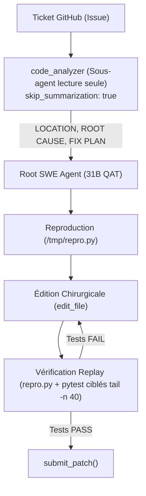

# Kaggle - The Gemma 4 Developer Agent Track (AGY Module)

Ce répertoire contient l'infrastructure d'évaluation, le packaging d'agent déclaratif Google ADK, et les pipelines de soumission pour la compétition **Google - The Gemma 4 Developer Agent** sur Kaggle.

---

## 1. Spécifications de l'Environnement Kaggle

- **Modèle imposé** : `gemma-4-31b-it-qat-w4a16-ct` (INT4 QAT W4A16, ~16-18 Go VRAM).
- **Cluster d'évaluation** : 4× NVIDIA L4 (24 Go GDDR6 chacune, soit 96 Go de VRAM totale).
- **Serveur d'inférence** : vLLM avec `tensor_parallel_size = 4`, `max_model_len = 32768` (contexte maximal strict de 32K tokens).
- **Parsing** : `tool_call_parser = "gemma4"`, `reasoning_parser = "gemma4"`, `thinking_budget = 4096`.
- **Sandboxes** : Conteneurs Docker hermétiques `swebench-sandbox:latest`, réseau désactivé (`network_mode="none"`), 4 Go RAM max, 2 vCPUs.
- **Budget global** : 12 heures pour l'ensemble des tâches de test (~120-129 tâches).

---

## 2. Les 9 Outils du Harness (`swegemma.tools`)

L'agent interagit exclusivement via les outils natifs injectés par le harness :

| # | Outil | Type | Particularité & Limite |
|---|---|:---:|---|
| 1 | `run_command(command)` | Budgetisé | Exécute du bash dans `/workspace`. Troncature à **5 000 caractères max depuis le début**. |
| 2 | `read_file(filepath, start_line, end_line)` | Budgetisé | Lecture 1-indexée. Troncature à **150 lignes max** et **10 000 caractères**. |
| 3 | `edit_file(filepath, old_string, new_string)` | Budgetisé | Remplacement atomique 3-tiers (exact, flexible, regex). Identique à SEARCH/REPLACE. |
| 4 | `write_file(filepath, content)` | Budgetisé | Création de fichier ou écrasement avec `mkdir -p` implicite. |
| 5 | `get_status()` | **Gratuit** | Retourne le temps et le quota d'appels d'outils restants. |
| 6 | `submit_patch()` | **Gratuit** | Déclenche `git diff HEAD` et valide la soumission. Doit être le dernier appel. |
| 7 | `get_code_neighbors(node, edge_type, max_neighbors)` | Budgetisé | Voisins synchrones AST NetworkX (graphe des appels). |
| 8 | `search_similar_code(query, k)` | Budgetisé | Embeddings pré-calculés. **Attention : fonctionne uniquement sur des symboles exacts**, pas sur du texte libre. |
| 9 | `get_code_subgraph(nodes)` | Budgetisé | Sous-graphe connectant une liste de symboles. |

---

## 3. Les 4 Pièges Critiques Identifiés (Gotchas)

1. **Le piège d'`eval_config.yaml`** :
   Le starter kit fournit un `eval_config.yaml` limitant arbitrairement chaque tâche à 1 minute et 10 tool calls, causant des timeouts systématiques ou un score de 0.00. Les meilleures soumissions **suppriment ce fichier** pour laisser le harness utiliser les limites par défaut.
2. **Troncature des 5 000 premiers caractères dans `run_command`** :
   `pytest` affiche son résumé d'échec et son verdict final tout à la fin de la sortie standard. Une sortie brute tronquée prive l'agent du diagnostic d'erreur. Les commandes de test doivent systématiquement être filtrées :
   `pytest -q --tb=short <target> | tail -n 40`
3. **Recherche de code (`search_similar_code`)** :
   L'outil ne fait pas d'embedding dynamique en temps réel mais cherche dans un dictionnaire hors-ligne. Passer une phrase en langage naturel retourne 0 résultat (similarité cosinus 0.999 sur tout). Utiliser des symboles précis (`ClassName`, `function_name`).
4. **Fenêtre de contexte limitée à 32K** :
   Tout appel verbeux ou lecture de fichier non ciblée remplit la mémoire de 32k tokens. Si le contexte dépasse 32 768 tokens, vLLM lève une exception non rattrapée et la tâche est notée 0. D'où l'importance de sous-agents dédiés à la navigation (`code_analyzer` avec `skip_summarization: true`).

---

## 4. Architecture de l'Agent Réactif (Replay Agent)



---

## 5. Procédure de Packaging & Validation

```bash
# Packaging propre et vérification stricte
bash kaggle/scripts/pack.sh

# Validation autonome
python3 kaggle/scripts/validate.py submission.zip
```

Critères validés :
- `agent.yaml` à la racine de l'archive.
- Aucun lien symbolique, aucun chemin relatif interdit (`../`).
- Modèle unique : `gemma-4-31b-it-qat-w4a16-ct`.
- Taille décompressée < 3 Go.
